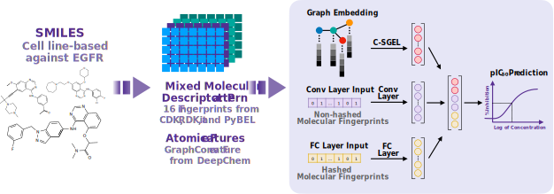
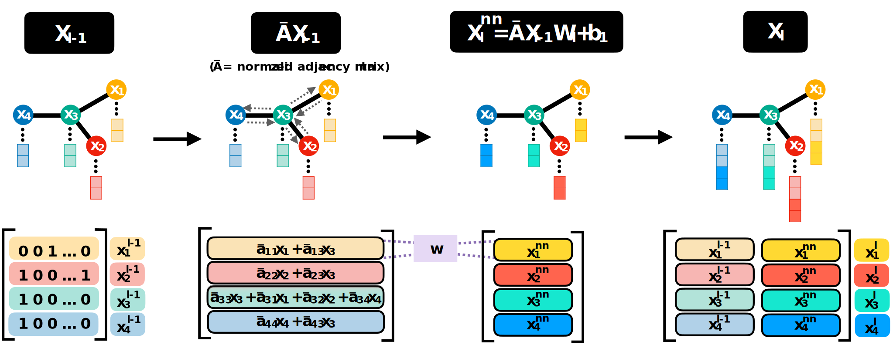

# LigEGFR

LigEGFR: Spatial graph embedding and molecular descriptors assisted bioactivity prediction of ligand molecules for epidermal growth factor receptor on cell line-based dataset

Puri Virakarin<sup>1</sup>, Natthakan Saengnil<sup>1</sup>, Bundit Boonyarit<sup>2</sup>, Jiramet Kinchagawat<sup>2</sup>, Rattasat Laotaew<sup>2</sup>, Treephop Saeteng<sup>2</sup>, Thanasan Nilsu<sup>1</sup>, Naravut Suvannang<sup>2,\*</sup>, Thanyada Rungrotmongkol<sup>3,4,\*</sup>, and Sarana Nutanong<sup>2,\*</sup>

<sup>1</sup>Kamnoetvidya Science Academy (KVIS), Rayong 21210, Thailand\
<sup>2</sup>School of Information Science and Technology, Vidyasirimedhi Institute of Science and Technology (VISTEC), Rayong 21210, Thailand\
<sup>3</sup>Program in Bioinformatics and Computational Biology, Graduate School, Chulalongkorn University, Bangkok 10330, Thailand\
<sup>4</sup>Biocatalyst and Environmental Biotechnology Research Unit, Department of Biochemistry, Faculty of Science, Chulalongkorn University, Bangkok 10330, Thailand



## About

LigEGFR is a novel deep learning architecture for pIC<sub>50</sub> prediction of small molecules against human epidermal growth factor receptor (EGFR) tyrosine kinase. The architecture inspired and adapted from a convolution spatial graph embedding layer (C-SGEL) conducted by graph convolutional networks and incorporated especial molecular descriptors. Most interestingly, this model is a notable high performance for the hit compound classification, compared to molecular docking and machine learning approaches. Moreover, our work is the first model that employed a large-scale and non-redundant dataset to enhance the diversity of the small molecules. Besides, we developed a user-friendly online platform that is compatible with all devices, and provide a Python executable script, to predict pIC<sub>50</sub> and classify the hit compounds. This approach opens a new avenue to apply for the hit and lead compounds discovery via targeted lung cancer therapy, offering a powerful strategy that potentially helps researchers overcome the drawbacks of drug discovery processes, and avoids pitfalls of conventional computation methods.

Herein, we provide LigEGFR web service at https://ligegfr.vistec.ist/, and Python executable file based-on Anaconda and Docker installation. 



## LigEGFR prediciton based-on Anaconda installation
This method supports for Linux and macOS operating systems.

### Prerequisites
#### Linux with GPU
1. Download Miniconda3-py37_4.8.3
```
wget -c https://repo.anaconda.com/miniconda/Miniconda3-py37_4.8.3-Linux-x86_64.sh -O Miniconda3-py37_4.8.3.sh
```
or
```
or curl https://repo.anaconda.com/miniconda/Miniconda3-py37_4.8.3-Linux-x86_64.sh -o Miniconda3-py37_4.8.3.sh
```
2. Install Miniconda 3 and package dependencies
```
chmod +x Miniconda3-py37_4.8.3.sh
./Miniconda3-py37_4.8.3.sh -b -f -p ./conda
